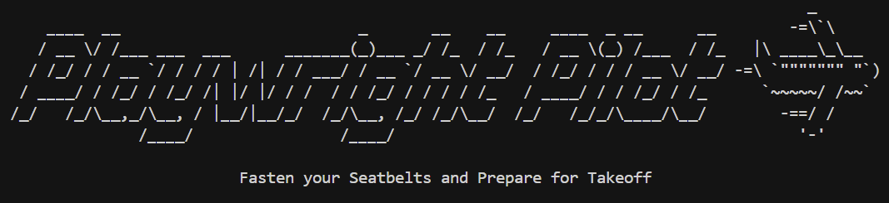

<div align="center">
  
</div>

Playwright Pilot is a Playwright-based automation framework with a first-class CLI designed to enforce consistency, traceability, and alignment with Azure DevOps Test Plans.

Inspired by classic Node CLI generators like express-generator, Pilot provides a structured, opinionated foundation for Playwright automation — establishing conventions early so teams can focus on writing meaningful tests instead of reinventing project structure.

The framework is built around features and suites, not ad-hoc test files, and includes tooling to create, manage, and reuse rich test data in a consistent and traceable way. Everything maps cleanly back to Azure DevOps, ensuring automation reflects how tests are planned, executed, and reviewed by QA teams and stakeholders.

## Who It's For

Playwright Pilot is designed for:

- **Automation engineers** building maintainable test suites
- **QA teams** managing tests in Azure DevOps Test Plans
- **Development teams** requiring consistent test structure and traceability

## Key Features

- **CLI Scaffolding** - Resource-scoped commands (`feature:add`, `page:add`, `spec:add`, `factory:add`, `trace:open`) automate framework setup
- **Page Objects + Fixtures** - Automatic wiring of page objects into Playwright fixtures
- **AutoPilot Workflows** - Cross-application actions like `autoPilot.login()` that work across features
- **Mailosaur Integration** - Invisible MFA automation, email content validation, spam analysis, and deliverability testing (see [docs/mailosaur.md](./docs/mailosaur.md))
- **ADO Test Plan Mapping** - Features map to test plans, suites to test suites, tests to test cases (see [docs/ado.md](./docs/ado.md))
- **Test Data System** - Models, builders (mimicry-js), factories, and split dataStore (system._ → canonical, test._ → runtime) (see [docs/testdata.md](./docs/testdata.md), [docs/tools.md](./docs/tools.md), and [docs/builders.md](./docs/builders.md))
- **Trace Capture + ADO Attachments** - Automatic trace recording and configurable artifact uploads to Azure DevOps (see [docs/artifacts.md](./docs/artifacts.md))
- **trace:open Command** - Quick access to Playwright HTML reports via `npm run pilot trace:open`

## Project Structure

```
playwright-pilot/
├── src/
│   ├── cli/                    # CLI commands and templates
│   ├── integrations/
│   │   └── azureDevops/        # Azure DevOps sync integration
│   ├── pages/                  # Page Object Model classes
│   ├── testdata/
│   │   ├── factories/         # Test data factories
│   │   ├── models/             # TypeScript models
│   │   ├── builders/           # Builders (mimicry-js) for factories
│   │   ├── dataStore.json      # Canonical system.* data (committed)
│   │   ├── runState.json       # Runtime test.* data (gitignored)
│   │   ├── system.ts           # System key registry
│   │   └── featureConfig.json  # Feature configuration for ADO
│   └── utils/
│       ├── autoPilot.ts        # Cross-app workflows (login, logout, etc.)
│       ├── dataStore.ts        # Data store utilities (set/get, save/load)
│       └── custom-list-reporter.ts
├── tests/
│   ├── <feature-key>/         # Tests organized by feature
│   └── fixtures/              # Playwright fixtures (global)
├── playwright.config.ts
└── package.json
```

## Bootstrap: Setting Up a New Repo

This guide walks you through setting up Playwright Pilot from scratch.

### Step 1: Install Dependencies

```bash
npm install
```

### Step 2: Build CLI (Optional)

To use the `pilot` command directly instead of `npm run pilot`:

```bash
npm run build:cli
npm link
```

This compiles the CLI and creates a global symlink. Skip this step if you prefer using `npm run pilot`.

### Step 3: Configure Environment (Optional)

Create a `.env` file in the root directory:

```env
# Base URL for the application
BASE_URL=http://localhost:3000

# Login credentials (used by autoPilot.login())
LOGIN_EMAIL=user@example.com
LOGIN_PASSWORD=password123

# Azure DevOps Integration
ADO_ORG_URL=https://dev.azure.com/your-org
ADO_PROJECT=your-project
ADO_TOKEN=your-personal-access-token
BUILD_ID=<valid-build-id-from-ado>
BUILD_NUMBER=20251205.1

# Set to 'true' to automatically sync test results to Azure DevOps after test runs
ADO_AUTO_SYNC=false

# Main toggle - enable/disable all artifact attachments
ADO_ATTACH_ARTIFACTS=true

# Only attach artifacts for failed tests (default: false)
ADO_ATTACH_ON_FAILURE_ONLY=false

# Individual artifact toggles (all default to true)
ADO_ATTACH_TRACE=true          # Attach trace.zip
ADO_ATTACH_ERROR_CONTEXT=true  # Attach error-context.md
ADO_ATTACH_LAST_RUN=true       # Attach .last-run.json

# Pilot Test Data Configuration
# PILOT_SEED: Set a fixed seed for reproducible test data (leave empty for auto-generated)
# PILOT_KEEP_RUNSTATE: Preserve runState.json between test runs (useful for multi-stage tests)
PILOT_SEED=
PILOT_KEEP_RUNSTATE=false
```

#### Environment Variable Reference

| Variable                     | Default        | Description                                    |
| ---------------------------- | -------------- | ---------------------------------------------- |
| `BASE_URL`                   | -              | Application base URL for tests                 |
| `LOGIN_EMAIL`                | -              | Default login email for `autoPilot.login()`    |
| `LOGIN_PASSWORD`             | -              | Default login password for `autoPilot.login()` |
| `ADO_ORG_URL`                | -              | Azure DevOps organization URL                  |
| `ADO_PROJECT`                | -              | Azure DevOps project name                      |
| `ADO_TOKEN`                  | -              | Azure DevOps personal access token             |
| `BUILD_ID`                   | -              | Azure DevOps build ID (for CI/CD)              |
| `BUILD_NUMBER`               | -              | Azure DevOps build number (for CI/CD)          |
| `ADO_AUTO_SYNC`              | `false`        | Auto-sync test results to ADO after runs       |
| `ADO_ATTACH_ARTIFACTS`       | `true`         | Master toggle for artifact attachments         |
| `ADO_ATTACH_ON_FAILURE_ONLY` | `false`        | Only attach artifacts for failed tests         |
| `ADO_ATTACH_TRACE`           | `true`         | Attach trace.zip files                         |
| `ADO_ATTACH_ERROR_CONTEXT`   | `true`         | Attach error-context.md files                  |
| `ADO_ATTACH_LAST_RUN`        | `true`         | Attach .last-run.json metadata                 |
| `PILOT_SEED`                 | Auto-generated | Fixed seed for reproducible test data          |
| `PILOT_KEEP_RUNSTATE`        | `false`        | Preserve runState.json between test runs       |

### Step 4: Create Your First Feature

Start with a foundational feature like "Login Page". **You must have your Azure DevOps test plan and suites created first.**

```bash
npm run pilot feature:add "Login Page"
```

The CLI will prompt you for:

- Azure DevOps Plan ID
- Suite names (e.g., "User Login", "Password Reset")
- Suite IDs for each suite

This creates:

- Feature configuration in `src/testdata/featureConfig.json`
- Test directory: `tests/login-page/`
- One spec file per suite (e.g., `LOGI-101-user-login.spec.ts`)
- A page object: `src/pages/login-page/LoginPage.ts`

### Step 5: Implement the Login Page Object

Open `src/pages/login-page/LoginPage.ts` and update it with your actual selectors and methods:

```typescript
// Page object for login UI interactions.
import type { Page } from "@playwright/test";

// Encapsulates interactions with the login UI.
export class LoginPage {
  private locators = {
    // TODO: Add your locators here
    loginTitle: '[data-testid="login-title"]',
    emailField: '[data-testid="input-email"]',
    passwordField: '[data-testid="input-password"]',
    loginButton: '[data-testid="btn-submit-login"]',
    loginError: '[data-testid="login-error"]',
  };

  constructor(private page: Page) {}

  // Navigates to the login page.
  async navigateToLogin() {
    await this.page.goto("/login");
    try {
      await this.page.locator(this.locators.loginTitle).waitFor({ timeout: 10000 });
    } catch (error) {
      throw new Error(
        `Timeout waiting for loginTitle locator: ${this.locators.loginTitle}. ${error instanceof Error ? error.message : String(error)}`
      );
    }
  }

  // Fills username and password fields.
  async enterLoginCredentials(email: string, password: string) {
    await this.page.locator(this.locators.emailField).fill(email);
    await this.page.locator(this.locators.passwordField).fill(password);
  }

  // Clicks the login button.
  async clickLoginButton() {
    await this.page.locator(this.locators.loginButton).click();
  }

  // Health check: verifies key elements are visible on the page.
  async healthCheck() {
    try {
      await this.page.locator(this.locators.loginTitle).waitFor({ timeout: 10000 });
    } catch (error) {
      throw new Error(
        `Timeout waiting for loginTitle locator: ${this.locators.loginTitle}. ${error instanceof Error ? error.message : String(error)}`
      );
    }
    const isVisible = await this.page.locator(this.locators.loginTitle).isVisible();
    if (!isVisible) {
      throw new Error("LoginPage health check failed: login title not visible");
    }
  }

  // Creates a LoginPilot adapter for AutoPilot.login().
  toLoginPilot() {
    return {
      goto: async () => {
        await this.navigateToLogin();
      },
      submit: async (username: string, password: string) => {
        // TODO: Replace the error below with your login implementation.
        // Example:
        //   await this.enterLoginCredentials(username, password);
        //   await this.clickLoginButton();
        throw new Error("Login submission is not configured. Implement submit() in LoginPage.toLoginPilot() using your app's locators.");
      },
    };
  }
}
```

### Step 6: Implement toLoginPilot() Adapter

The CLI generates a stubbed `toLoginPilot()` method for Login pages (shown in Step 4 above). Replace the `throw new Error()` in the `submit()` method with your actual implementation:

```typescript
// In LoginPage.ts - replace the stubbed submit() method
submit: async (username: string, password: string) => {
  await this.enterLoginCredentials(username, password);
  await this.clickLoginButton();
},
```

The complete `toLoginPilot()` method should look like:

```typescript
toLoginPilot() {
  return {
    goto: async () => {
      await this.navigateToLogin();
    },
    submit: async (username: string, password: string) => {
      await this.enterLoginCredentials(username, password);
      await this.clickLoginButton();
    },
  };
}
```

This adapter enables `autoPilot.login()` to work across your entire test suite. See [docs/login.md](./docs/login.md) for details.

### Step 7: Verify Fixtures Wiring

The CLI automatically wires `LoginPage` into fixtures. This keeps tests clean by passing page objects through fixtures instead of requiring manual instantiation in each test.

**Benefits of the fixture pattern:**

- **Clean tests** - Tests receive page objects via fixtures (e.g., `{ loginPage }`) instead of manually instantiating them with `new LoginPage(page)`
- **Consistent setup** - All page objects are created and wired once in the fixtures file
- **Type safety** - TypeScript ensures fixtures are properly typed and available

Check `tests/fixtures/test-fixtures.ts`:

```typescript
import { test as base, expect } from "@playwright/test";
import { LoginPage } from "../../src/pages/login-page/LoginPage";
import { AutoPilot, type LoginPilot } from "../../src/utils/autoPilot";

type Fixtures = {
  autoPilot: AutoPilot;
  loginPilot: LoginPilot;
  loginPage: LoginPage;
};

export const test = base.extend<Fixtures>({
  loginPage: async ({ page }, use) => {
    await use(new LoginPage(page));
  },

  loginPilot: async ({}, use) => {
    const pilot: LoginPilot = {
      async goto() {
        throw new Error("Login is not configured. Provide a LoginPilot implementation in your fixtures to enable autoPilot.login().");
      },
      async submit() {
        throw new Error("Login is not configured. Provide a LoginPilot implementation in your fixtures to enable autoPilot.login().");
      },
    };

    await use(pilot);
  },

  autoPilot: async ({ page, loginPilot }, use) => {
    await use(new AutoPilot(page, loginPilot));
  },
});

export { expect };
```

**Update the `loginPilot` fixture:** Replace the stub implementation with code that calls `toLoginPilot()` on your login page fixture:

```typescript
// Replace the stub with this implementation:
loginPilot: async ({ loginPage }, use) => {
  await use(loginPage.toLoginPilot());
},
```

**Note:** If your page fixture has a different name (not `loginPage`), adjust the fixture dependency accordingly. For example, if your page fixture is called `myLoginPage`:

```typescript
loginPilot: async ({ myLoginPage }, use) => {
  await use(myLoginPage.toLoginPilot());
},
```

This wiring enables tests to use `autoPilot.login()` without knowing login page details.

### Step 8: Write Your First Test

Open the generated spec file (e.g., `tests/login-page/LOGI-101-user-login.spec.ts`) and implement your test:

```typescript
import { test, expect } from "../fixtures/test-fixtures";
import * as factories from "../../src/testdata/factories";

// ---
// Tests for User Login
// Feature: login-page
// Tag: @login-page
// ADO Plan ID: 2
// ADO Suite IDs: 7
// ---

test.describe.serial("LOGI-101 - User Login @login-page", () => {
  test("[10001] Login with valid credentials", async ({ page, autoPilot, set, get }) => {
    await test.step("Login to application", async () => {
      await autoPilot.login();
    });

    await test.step("Verify successful login", async () => {
      // Example assertions:
      // await expect(page).toHaveURL(/dashboard/);
      // await expect(page.locator('[data-testid="user-menu"]')).toBeVisible();
    });
  });

  test("[10002] invalid password", async ({ loginPage }) => {
    const pilot = loginPage.toLoginPilot();

    await test.step("Attempt login with invalid password", async () => {
      await pilot.goto();
      await pilot.submit("user@test.com", "wrong-password");
    });

    await test.step("Verify failed login message", async () => {
      // Example assertions:
      // await expect(page.locator('[data-testid="error-message"]')).toBeVisible();
      // await expect(page.locator('[data-testid="error-message"]')).toContainText("Invalid credentials");
    });
  });
});
```

**Important:** Replace the test case ID (`[10001]`) with your actual Azure DevOps test case ID.

### Step 9: Run Tests

```bash
# Run all tests
npm test

# Run tests for a specific feature
npm test -- --grep @login-page

# Run in UI mode
npm run test:ui
```

### Step 10: View Test Results

```bash
# Open Playwright HTML report
npm run pilot trace:open
```

### Step 11: Sync to Azure DevOps (Optional)

After tests pass, sync results to Azure DevOps:

```bash
npm run sync:ado
```

## Next Steps

- **Add more suites**: `npm run pilot suite:add --feature "login-page"`
- **Create additional features**: `npm run pilot feature:add "User Management"`
- **Create shared page objects**: `npm run pilot page:add "Dashboard"`
- **Create test data factories**: `npm run pilot factory:add "User"`
- **Run preflight check**: `npm run pilot preflight`
- **Execute tests**: `npm run pilot takeoff`

## Email & MFA Testing with Mailosaur

Playwright Pilot includes built-in Mailosaur integration for testing email workflows and automating MFA login flows.

**Key capabilities:**

- **Invisible MFA** - `autoPilot.login(mfaUser)` automatically handles OTP retrieval
- **Email Validation** - Verify Salesforce emails have correct content, links, and attachments
- **Spam Analysis** - Check SpamAssassin scores to ensure emails reach inboxes
- **Deliverability** - Validate SPF/DKIM/DMARC authentication passes

**Quick example:**

```typescript
test("[10001] Order confirmation email is correct", async ({ mail, ordersPage }) => {
  const recipient = "customer@abc123.mailosaur.net";

  await test.step("Trigger email", async () => {
    await ordersPage.sendConfirmation();
  });

  await test.step("Validate email content", async () => {
    const message = await mail.waitForMessage(recipient, {
      subjectContains: "Order Confirmation",
    });
    expect(message.textBody).toContain("Thank you for your order");
  });
});
```

See [docs/mailosaur.md](./docs/mailosaur.md) for complete setup, fixture API reference, and advanced usage.

## Documentation

- **[docs/cli.md](./docs/cli.md)** - Complete CLI command reference
- **[docs/ado.md](./docs/ado.md)** - Azure DevOps mapping philosophy and structure
- **[docs/testdata.md](./docs/testdata.md)** - Models, factories, and dataStore usage
- **[docs/login.md](./docs/login.md)** - AutoPilot and LoginPilot architecture
- **[docs/mailosaur.md](./docs/mailosaur.md)** - Mailosaur integration for MFA and email testing
- **[docs/artifacts.md](./docs/artifacts.md)** - Trace capture and ADO attachments

## Golden Rules

- ✅ Create test plans and suites in Azure DevOps **first**
- ✅ Use the Pilot CLI to mirror your Azure DevOps structure
- ✅ Use `autoPilot.login()` for cross-feature login workflows
- ✅ Use `set/get` for runtime test data, `save/load` for persistent system keys
- ❌ Do not hand-edit `featureConfig.json`
- ❌ Do not manually wire fixtures or page objects
- ❌ Do not create suite (spec) files by hand

## License

See LICENSE file for details.
